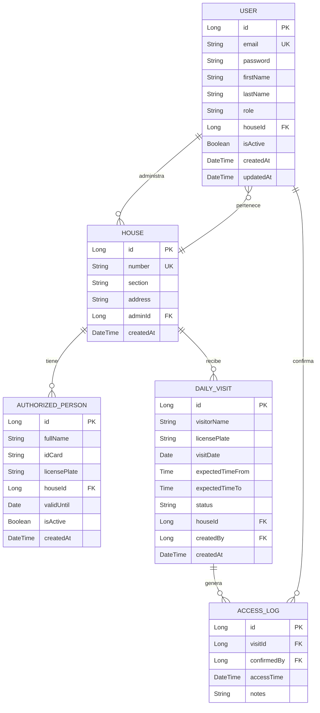

# UrbanEntry - Arquitectura del Sistema

## 🎯 Visión General

UrbanEntry es una Progressive Web App (PWA) offline-first para gestión de accesos en condominios, con arquitectura monolítica en capas desplegada en servidor local.

## 🎨 Paleta de Colores (basada en logo)

```css
/* Colores Primarios */
--primary-blue: #1565C0;      /* Azul oscuro - edificios */
--primary-blue-light: #1976D2; /* Azul medio */
--primary-blue-lighter: #42A5F5; /* Azul claro */

/* Colores Secundarios */
--secondary-green: #4CAF50;    /* Verde - puerta */
--secondary-green-dark: #388E3C;
--secondary-green-light: #66BB6A;

/* Colores Neutros */
--neutral-dark: #263238;       /* Texto principal */
--neutral-medium: #546E7A;     /* Texto secundario */
--neutral-light: #ECEFF1;      /* Fondos claros */
--neutral-lighter: #F5F7FA;    /* Fondos muy claros */
--white: #FFFFFF;

/* Estados */
--success: #4CAF50;
--warning: #FF9800;
--error: #F44336;
--info: #2196F3;
```

## 🏗️ Arquitectura de Capas

```
┌─────────────────────────────────────────────────┐
│           CLIENTES (Devices)                    │
│  📱 Móviles  💻 Tablets  🖥️ Desktops           │
└───────────────────┬─────────────────────────────┘
                    │ HTTPS
                    │
┌───────────────────▼─────────────────────────────┐
│         FRONTEND (React PWA)                    │
│  ┌──────────────────────────────────────────┐  │
│  │  UI Components (React)                   │  │
│  │  - Login / Register                      │  │
│  │  - Resident Dashboard                    │  │
│  │  - Officer Dashboard                     │  │
│  │  - Admin Panel                           │  │
│  ├──────────────────────────────────────────┤  │
│  │  State Management (Context API + Hooks)  │  │
│  ├──────────────────────────────────────────┤  │
│  │  API Client (Axios + Interceptors)       │  │
│  ├──────────────────────────────────────────┤  │
│  │  PWA Engine                              │  │
│  │  - Service Worker (offline cache)        │  │
│  │  - IndexedDB (local storage)             │  │
│  │  - Background Sync                       │  │
│  └──────────────────────────────────────────┘  │
└───────────────────┬─────────────────────────────┘
                    │ REST API (JSON)
                    │
┌───────────────────▼─────────────────────────────┐
│         BACKEND (Spring Boot)                   │
│  ┌──────────────────────────────────────────┐  │
│  │  REST Controllers                        │  │
│  │  - AuthController                        │  │
│  │  - UserController                        │  │
│  │  - HouseController                       │  │
│  │  - AuthorizedPersonController            │  │
│  │  - DailyVisitController                  │  │
│  │  - AccessLogController                   │  │
│  ├──────────────────────────────────────────┤  │
│  │  Security Layer                          │  │
│  │  - Spring Security                       │  │
│  │  - JWT Authentication                    │  │
│  │  - Role-based Authorization              │  │
│  ├──────────────────────────────────────────┤  │
│  │  Service Layer                           │  │
│  │  - Business Logic                        │  │
│  │  - Validation                            │  │
│  │  - Email Notifications                   │  │
│  ├──────────────────────────────────────────┤  │
│  │  Repository Layer (Spring Data JPA)      │  │
│  └──────────────────────────────────────────┘  │
└───────────────────┬─────────────────────────────┘
                    │ JDBC
                    │
┌───────────────────▼─────────────────────────────┐
│         DATABASE (PostgreSQL)                   │
│  - users                                        │
│  - houses                                       │
│  - authorized_persons                           │
│  - daily_visits                                 │
│  - access_logs                                  │
└─────────────────────────────────────────────────┘
```

## 🔐 Modelo de Seguridad

### Flujo de Autenticación JWT

```
1. Usuario → POST /api/auth/login {email, password}
2. Backend valida credenciales
3. Backend genera JWT token (válido 24h)
4. Frontend almacena token (localStorage + secure)
5. Todas las peticiones incluyen: Authorization: Bearer <token>
6. Backend valida token en cada request
```

### Roles y Permisos

| Rol               | Código        | Permisos                                          |
|-------------------|---------------|---------------------------------------------------|
| SUPER_ADMIN       | ROLE_SUPER    | Gestión global del sistema                        |
| RESIDENT_ADMIN    | ROLE_ADMIN    | Gestión completa de SU casa                       |
| RESIDENT_MEMBER   | ROLE_MEMBER   | Ver y crear autorizados/visitas de SU casa        |
| SECURITY_OFFICER  | ROLE_OFFICER  | Solo lectura + confirmar ingresos                 |

## 📊 Modelo de Datos



## 🌐 API REST Endpoints

### Autenticación
- `POST /api/auth/register` - Registro nuevo usuario
- `POST /api/auth/login` - Login
- `POST /api/auth/refresh` - Refresh token
- `GET /api/auth/me` - Info usuario actual

### Usuarios
- `GET /api/users` - Listar (solo admins)
- `GET /api/users/{id}` - Ver detalle
- `PUT /api/users/{id}` - Actualizar
- `DELETE /api/users/{id}` - Eliminar

### Casas
- `GET /api/houses` - Listar
- `POST /api/houses` - Crear
- `GET /api/houses/{id}` - Ver detalle
- `PUT /api/houses/{id}` - Actualizar
- `GET /api/houses/{id}/members` - Miembros de casa

### Autorizados Permanentes
- `GET /api/authorized` - Listar (filtro por casa)
- `POST /api/authorized` - Crear
- `GET /api/authorized/{id}` - Ver detalle
- `PUT /api/authorized/{id}` - Actualizar
- `DELETE /api/authorized/{id}` - Eliminar
- `GET /api/authorized/search?q={query}` - Buscar (oficial)

### Visitas Diarias
- `GET /api/visits` - Listar (filtro por fecha/casa)
- `POST /api/visits` - Crear
- `GET /api/visits/{id}` - Ver detalle
- `DELETE /api/visits/{id}` - Cancelar
- `GET /api/visits/today` - Visitas de hoy (oficial)

### Control de Accesos
- `POST /api/access/confirm/{visitId}` - Confirmar ingreso
- `GET /api/access/logs` - Historial
- `GET /api/access/logs/house/{houseId}` - Historial por casa

## 📱 Estrategia Offline-First

### Service Worker - Cache Strategy

```javascript
// Cache First (archivos estáticos)
- /static/css/*
- /static/js/*
- /static/media/*
- /manifest.json
- /favicon.ico

// Network First, fallback Cache (API)
- /api/authorized/search*
- /api/visits/today*

// Network Only (operaciones críticas)
- /api/auth/*
- /api/access/confirm*

// Stale While Revalidate (datos)
- /api/users/me*
- /api/houses/*
```

### IndexedDB Stores

```javascript
// Stores locales
- authorizedPersons (para búsqueda offline)
- dailyVisits (visitas del día)
- pendingSync (acciones pendientes de sincronizar)
- userCache (datos del usuario)
```

### Background Sync

Cuando se recupera conexión:
1. Sincronizar confirmaciones de acceso pendientes
2. Actualizar visitas del día
3. Refrescar autorizados
4. Enviar notificaciones pendientes

## 🚀 Infraestructura y Despliegue

### Servidor Local

```
Hardware Recomendado:
- CPU: 4 cores
- RAM: 8GB
- Disco: 100GB SSD
- OS: Ubuntu Server 22.04 LTS

Software Stack:
- Java 17 (OpenJDK)
- PostgreSQL 15
- Nginx (reverse proxy + HTTPS)
- Certbot (Let's Encrypt)
```

### Configuración Red

```
Modo 1: Solo LAN (sin internet)
- IP Local: 192.168.1.100
- URL: https://urbanentry.local
- Certificado: Autofirmado

Modo 2: LAN + Internet
- IP Local: 192.168.1.100
- Dominio Público: https://condominioxyz.urbanentry.app
- Certificado: Let's Encrypt
- DynDNS: Para IP dinámica
```

### Nginx Configuration

```nginx
server {
    listen 80;
    server_name urbanentry.local condominioxyz.urbanentry.app;
    return 301 https://$server_name$request_uri;
}

server {
    listen 443 ssl http2;
    server_name urbanentry.local condominioxyz.urbanentry.app;

    ssl_certificate /etc/letsencrypt/live/domain/fullchain.pem;
    ssl_certificate_key /etc/letsencrypt/live/domain/privkey.pem;

    # Frontend (React build)
    location / {
        root /var/www/urbanentry/frontend/build;
        try_files $uri $uri/ /index.html;
    }

    # Backend API
    location /api {
        proxy_pass http://localhost:8080;
        proxy_set_header Host $host;
        proxy_set_header X-Real-IP $remote_addr;
    }
}
```

## 📧 Sistema de Notificaciones

### Fase MVP: Email

```
Eventos que disparan email:
1. Visita confirmó ingreso → Email a residente
2. Nuevo miembro agregado → Email de bienvenida
3. Autorizado próximo a vencer → Email recordatorio

Proveedor: JavaMail API (SMTP local o Gmail)
```

### Fase Futura: Push Notifications

```javascript
// Web Push API
if ('PushManager' in window) {
  // Registrar push subscription
  // Enviar desde backend con web-push library
}
```

## 🔒 Consideraciones de Seguridad

### Backend
- ✅ BCrypt para passwords (cost 12)
- ✅ JWT con firma HMAC SHA-256
- ✅ CORS configurado específicamente
- ✅ Rate limiting en endpoints críticos
- ✅ Validación de inputs (Bean Validation)
- ✅ SQL Injection prevention (JPA)
- ✅ XSS prevention (sanitización)

### Frontend
- ✅ HTTPS obligatorio
- ✅ Content Security Policy headers
- ✅ HttpOnly cookies para tokens sensibles
- ✅ Sanitización de inputs
- ✅ No almacenar passwords en cliente

### Base de Datos
- ✅ Encriptación en reposo (PostgreSQL)
- ✅ Backups automáticos diarios
- ✅ Usuario DB con permisos mínimos
- ✅ Auditoría de cambios (timestamps)

## 📈 Escalabilidad Futura

El sistema monolítico puede escalar a:
- Múltiples condominios (multi-tenancy)
- Integración con cámaras (reconocimiento facial)
- App móvil nativa (React Native)
- Panel de analíticas
- Integración con sistemas de puertas automáticas

## 🛠️ Herramientas de Desarrollo

- **IDE**: IntelliJ IDEA / VS Code
- **Control de versiones**: Git + GitHub
- **API Testing**: Postman / Insomnia
- **DB Client**: DBeaver / pgAdmin
- **Logs**: Logback (Spring Boot)
- **Monitoring**: Actuator endpoints

---

**Versión**: 1.0  
**Última actualización**: Enero 2026
